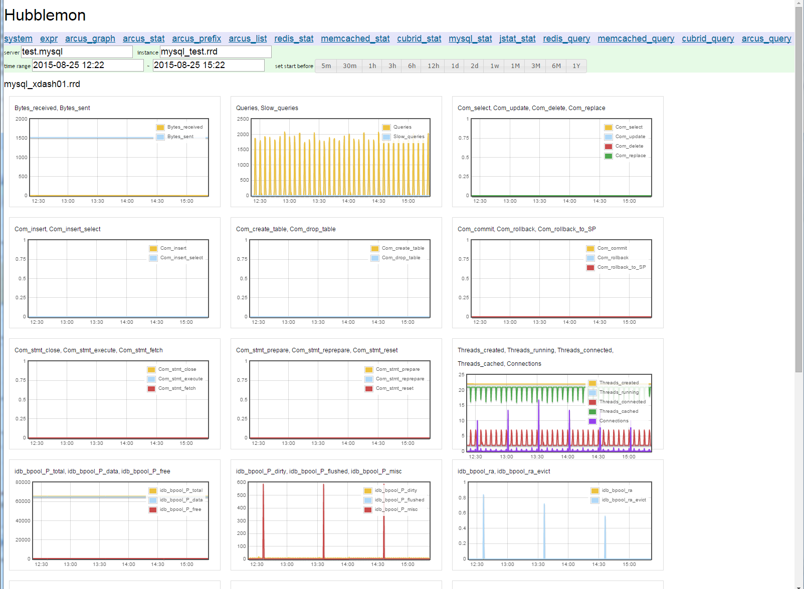
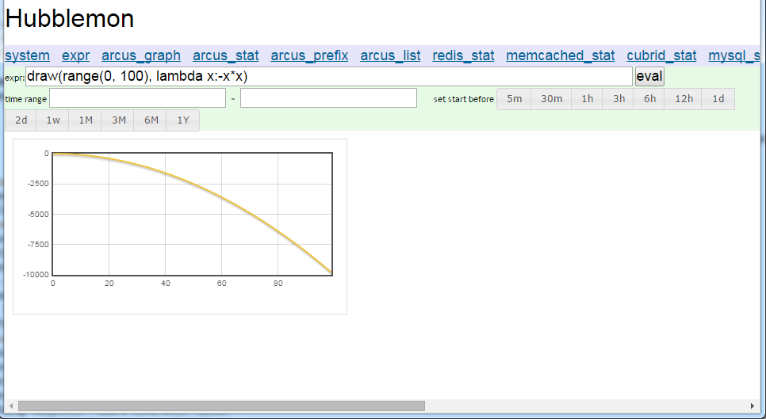
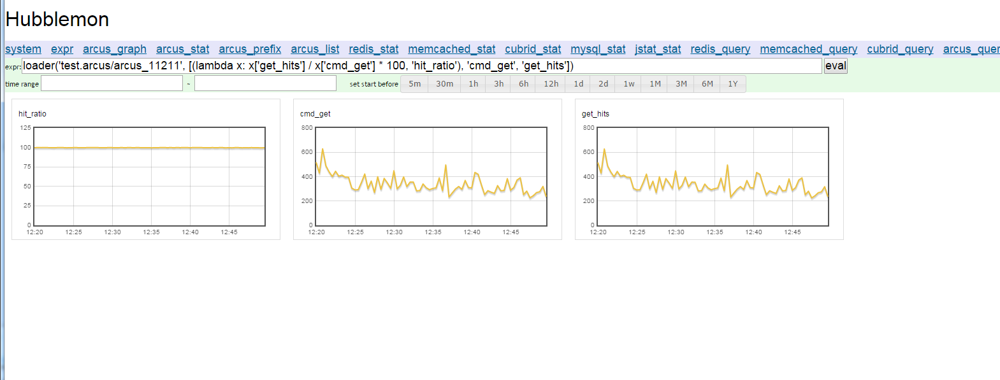
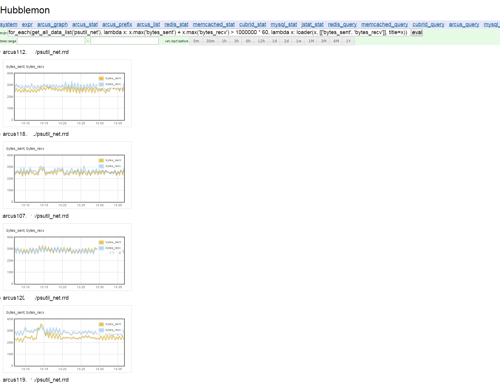

# Hubblemon

허블몬은 범용 모니터링, 관리 도구로서 파이썬3와 장고 기반으로 만들어져 있다.

처음에는 아커스 (네이버에서 개발한 memcached 기반의 메모리 클라우드) 를 위한 운영툴로서 시작되었으나 여러 클라이언트 플러그인을 지원한다.

## Supported client

* Arcus
* memcached
* redis
* Cubrid
* Mysql
* jstat (GC time)


## Usage

### monitoring

아래는 허블몬의 모니터링 뷰로서.
이 지원되는 클라이언트 외에도 다른 뷰들을 쉽게 추가할 수 있다.

system monitoring view


arcus/memcached monitoring view


redis monitoring view


mysql monitoring view



### Query

허블몬은 클라이언트에 전용 쿼리를 쉽게 날릴 수 있는 기능도 있다.
이 쿼리 페이지는 query mode, eval mode 의 두 모드로 동작한다.

query 모드에서는 허블몬으로 아스키 명령이나(memcached, redis, arcus 의 경우) SQL 을 (mysql, cubrid 의 경우) 실행시킬 수 있다.

eval 모드에서는 허블몬의 인풋 필드에 있는 스크립트를 해당 클라이언트에 대해 실행시킬 수 있다.

먼저, 쿼리 모드의 예가 아래에 나와 있다. 허블몬 페이지가 아스키 명령을 memcached 에 전송하고 그 결과값을 가져오는 모습이다.


아래는 mysql 에서의 모습으로 허블몬이 쿼리를 실행시키고 그 결과값을 출력하는 모습이다.


eval 모드에서는 conn, cursor 변수가 스크립트를 위해 미리 설정되어 있다.

아래 페이지에서 conn 은 test.memcached 머신의 11211 포트에 있는 memcached 로의 연결로 미리 설정된 후 입력창의 스크립트를 실행한다.

해당 memcached 에 0 부터 99까지를 기록하고 그 값을 다시 읽어와서 리스트에 기록한다.
그리고 return_as_string(ret, p) 를 통해 웹화면에 출력한다.
p 는 파마미터관리를 위한 내부 변수로서, 허블몬은 실제로 p['result'] 의 값을 출력하며 이 예제에서 이는 return_as_string 안에서 기록된다.


아래는 또다른 예제로서,
conn 과 cursor 가 test.mysql 에 있는 MySql 에 대한 접속과 커서로 미리 설정된다.
스크립트는 테이블을 생성하고 0 부터 99 까지 입력한다.
return_as_table(cursor, p) 는 cursor 로부터 html table 을 생성하여 출력한다.


### Analyze stat file using python eval

아래의 expr 페이지는 파이썬의 eval 기능으로 만들어져 있으며, 입력 필드를 실행하고 그 결과값으로부터 페이지를 생성한다.



따라서, 사용자는 이미 있는 stat 정보로부터 무엇이든 할 수 있다.

간단하게는 아래와 같이 데이터 파일을 읽고 표시할 수 있다. loader 함수를 이용해 test.arcus  의 cpu stats 를 선택하고 그 중 user, system, idle 항목으로 차트를 만들어 표시했다.


아래 예제에서는 cmd_get, cmd_set 을 맡은 차트에 그리고 get_hits 를 추가로 그린다.


람다 함수를 사용하면 각 매트릭을 복잡하게 가공할 수 있다.
아래 예제에서는 람다 함수 하나로 매트릭으로부터 hit ratio 를 만들어 표시했다.




그리고 허블몬에서 미리 정의한 for_each(data_list, filter, output) 함수를 사용할 수도 있다.
이것으로 전체 데이터에 대한 분석과 조사를 단 한줄로 실행할 수 있다.

예를 들어보면,

아래는 모든 클라이언트들의 (get_all_data_list(prefix) 는 모든 클라이언트의 데이터 항목들 중 prefix 로 시작하는 목록을 넘겨준다) 정보를 순회하며 bytes_recv + bytes_send 의 최대값이 60M bytes 를 초과하는 것을 차트로 그리고 있다. 

이 스크립트로 무거운 클라이언트를 찾을 수 있다.

	for_each(get_all_data_list('psutil_net'), lambda x: x.max('bytes_sent') + x.max('bytes_recv') > 1000000*60, lambda x: loader(x, [['bytes_sent', 'bytes_recv']], title = x))



유사하게 다른 매트릭으로 같은 작업을 할 수 있다 (CPU 사용율, disk I/O 등)

아래의 다른 예제는 사용율이 낮은 아커스 클라이언트를 찾는다.

	for_each(arcus_instance_list(arcus_cloud_list()), lambda x: x.avg('cmd_get') < 100, lambda x : loader(x, ['cmd_get'], title=x))

arcus_cloud_list() 는 허블몬이 수집하고 있는 모든 아커스 클라우드들의 리스트를 반환하고, arcus_instance_list 는 클라우드를 구성하는 인스턴스들을 반환한다. 따라서 첫번째 파라미터는 허블몬안의 모든 아커스 클라이언트를 목록으로 전달하며,

두번째 파라미터에서는 cmd_get 의 QPS가 100 이하인 것들을 찾는다. 여기서 찾아진 것들은 세번째 파라미터를 통해 차트로 그려진다.


## Architecture


허블몬은 허블몬 웹서버, collect server, collect listener, collect client 로 구성된다.

Collect client 는 Collect server 에 접속하여 자신이 정보를 보낼 collect listener 에 대한 정보를 받는다.

Collect client 는 정보를 수집한 후 collect listener 로 전송한다.

Collect listener 는 정보를 수집한 후 저장하고, 알람 케이스에 해당되는 것이 있는지 조사한다.

저장된 정보는 허블몬 웹에서 사용된다.
허블몬 웹서버는 리스너가 같은 장비에 설치되어 있을 경우 디스크에서 stat 을 바로 읽을 수 있고, 확장성을 위해 리스너가 다른 장비들에 설치되어 있을 경우 원격으로 해당 정보를 읽어올 수 있다.


## Installation

### Requirement

python3
django
rrdtool (above 1.4.9)
python modules: pytz, rrdtool and kazoo


### Installation

[installation guide](doc/install.md)


## Issues & User group

허블몬 사용자 그룹은 [여기](https://groups.google.com/forum/#!forum/hubblemon)


## License

허블몬은 아파치 라이센스 2.0 으로 배포된다.
상세 내용은 [LICENSE](LICENSE) 에서 확인할 수 있다.

```
Copyright 2014 Naver Corp.

Licensed under the Apache License, Version 2.0 (the "License");
you may not use this file except in compliance with the License.
You may obtain a copy of the License at

    http://www.apache.org/licenses/LICENSE-2.0

Unless required by applicable law or agreed to in writing, software
distributed under the License is distributed on an "AS IS" BASIS,
WITHOUT WARRANTIES OR CONDITIONS OF ANY KIND, either express or implied.
See the License for the specific language governing permissions and
limitations under the License.
```
