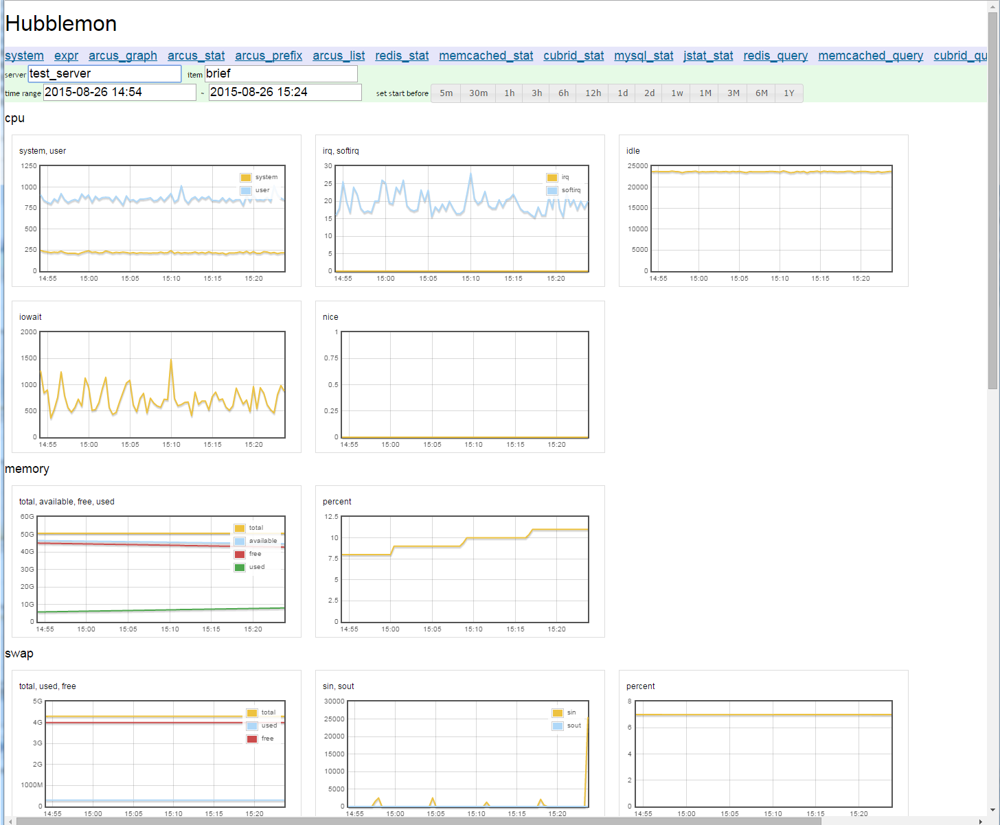
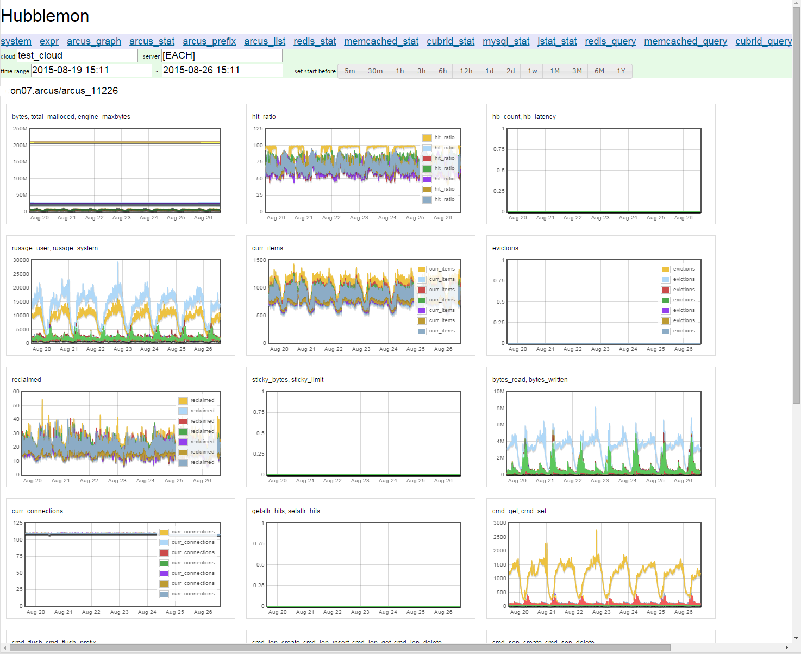
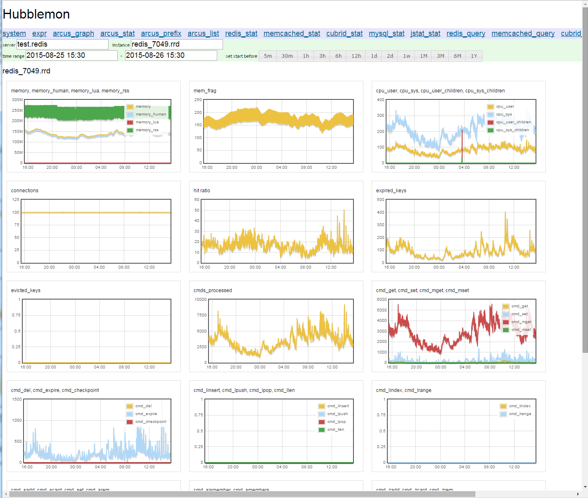
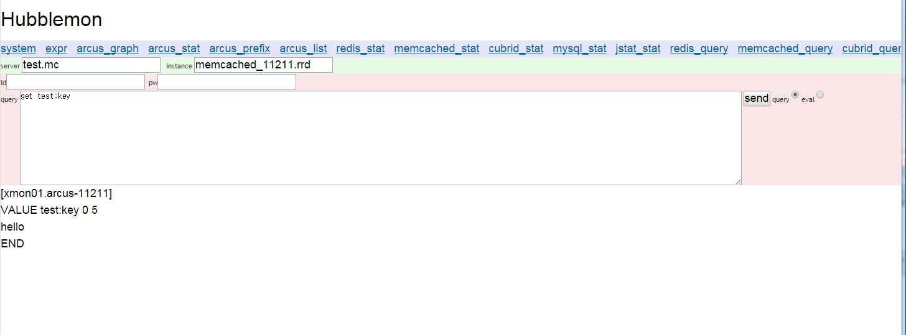
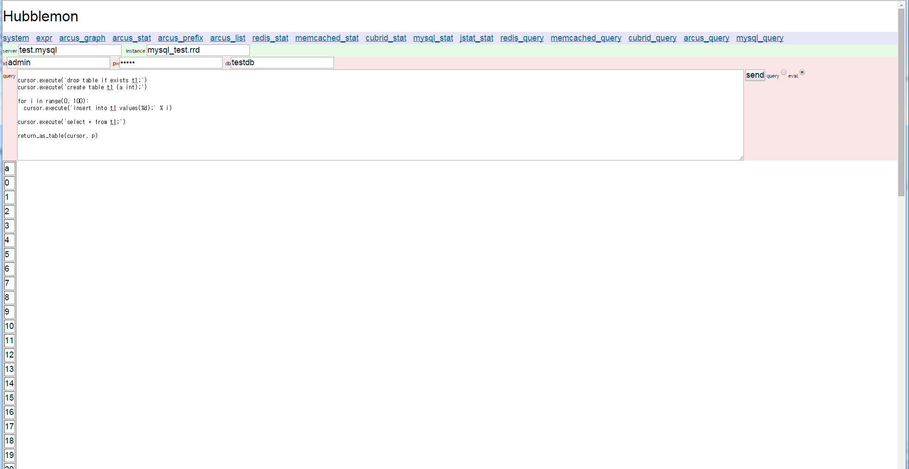
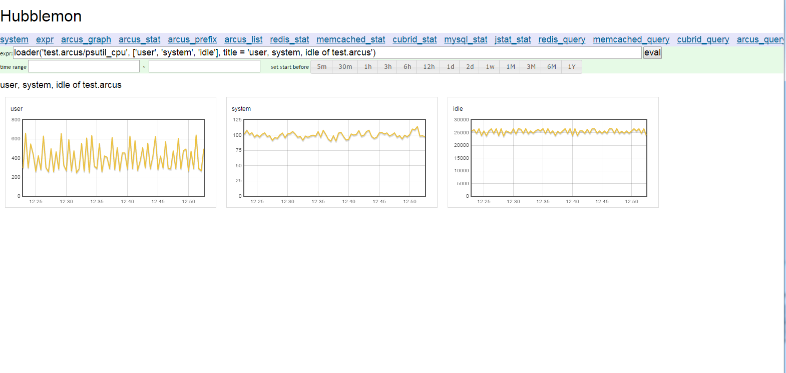
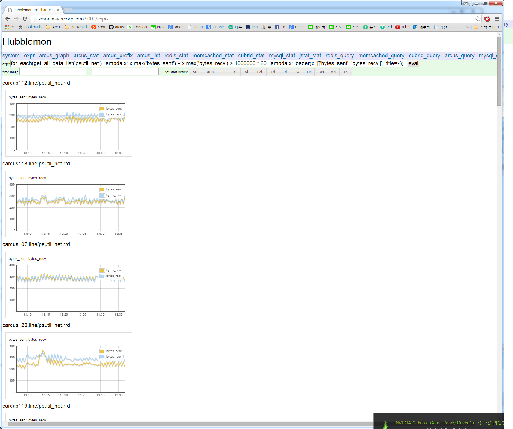
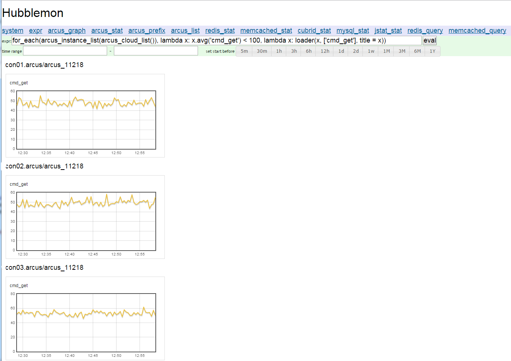
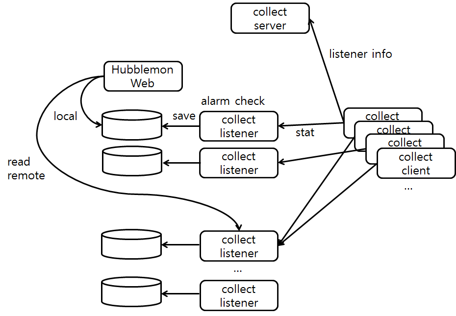

# Hubblemon

Hubblemon is a general purpose system, application monitoring & management tool which is made with python3 with Django framework.

It's made for Arcus (memcached cloud for Naver corp) monitoring first time.
And now it support various client plugins.


## Supported client

* Arcus
* memcached
* redis
* Cubrid
* Mysql
* jstat (GC time)


## Usage

### monitoring

Below images are example of hubblemon monitoring views.
You can use supporeted clients or made your own clients easily.

system monitoring view


arcus/memcached monitoring view


redis monitoring view


mysql monitoring view


### Query

Hubblemon can handle clients with their own query.
Thease query pages have two mode. query mode and eval mode.
In query mode, hubblemon send ascii command (memcached, redis, arcus) or SQL (mysql, cubrid)

In eval mode, hubblemon execute script in input field and make return.


First, as query mode examples below hubblemon page send ascii command to memcached
It send get command and display returned data.



Below page is mysql query. Hubblemon sends mysql query and prints results.


In eval mode, 'conn' and 'cursor' variable is pre-setted and user use this value for script.

In below page, conn is pre-set as memcached connection of xmon01.arcus(11211 port)
Script set 0 to 99 to memcached and recevie them as list.
Hubblemon prints lists with return_as_string(ret, p)
p is an inner variable to handle parameter. Hubblemon prints p['result'] which is set in return_as_string 


Here is another example,
conn and cursor is pre-set as mysql connection and cursor of Mysql in xmon01.arcus 
Script creates table and inserts 0 to 99 to table and select them.
return_as_table(cursor, p) make html table from DB cursor.




### Analyze stat file using python eval

Below expr page is made using python eval. It eval python script expression in input field and generate result page.


So, User can do everything with saved data files in this page.

Simply, read data like below. It calls default_loader function which is  pre-defined in hubblemon. That function read cpu stats of ccon01.arcus machine and select user, system, idle stats.



Below example shows another usage. cmd_get, cmd_set at same chart and get_hits



You can use lambda function for more complex view.
Below example calculate hit ratio and draw in chart with just one lambda function.


And If you use for_each(data_list, filter, output) function of hubblemon.
You can examine and analyze clients stat by one line expression

for_each function read all stat datas of data_list and pass it two second filter lambda function. If second filter return True, output lambda function execute filtered list.

for some examples,

below expression traverse all clients (get_system_list returns all clients which send stats to hubblmon server) and find bytes_recv + bytes_send are over 60M bytes,
And show that lists

With this expression, You can find heavy clients.

	for_each(get_system_list('psutil_net'), lambda x: x.max('bytes_sent') + x.max('bytes_recv') > 1000000*60, lambda x: default_loader(x, [['bytes_sent', 'bytes_recv']], title = x))


Similarly you can find and draw chart with other stat (like CPU usage, disk I/O etc)

Below another example shows cold arcus clients.

	for_each(arcus_instance_list(arcus_cloud_list()), lambda x: x.avg('cmd_get') < 100, lambda x : default_loader(x, ['cmd_get'], title=x))

arcus_cloud_list() return all cloud list of hubblemon, arcus_instance_list return each instance of cloud. So first parameter of for_each returns all instance list of arcus.
second parameter check average cmd_get QPS is below 100. If so, third lambda parameter draw that instance (whose average QPS is below than 100)




## Architecture



Hubblemon components are Hubblemon Web, collect server, collect listener and collect client.

Collect client connect collect server at first time. 
Then collect server sends listener info which collect client should connect.
With this info, collect client connect to corrent collect listener.

Collect client collects client stats (system and application stat) and send it to collect listener.

Collect listener receives clients stats and save it to disk. And it check alarm cases or not.

With thease saved stats, Hubblemon show to user client stats like above pages.


## Installation

### Requirement

python3
django
rrdtool (above 1.4.9)
python modules: pytz, rrdtool and kazoo


### Installation

Read [installation guide](doc/install.md)


## Issues & User group

Hubblemon usergroup is [here](https://groups.google.com/forum/#!forum/hubblemon)


## License

Hubblemon is licensed under the Apache License, Version 2.0
See [LICENSE](LICENSE) for full license text.

```
Copyright 2014 Naver Corp.

Licensed under the Apache License, Version 2.0 (the "License");
you may not use this file except in compliance with the License.
You may obtain a copy of the License at

    http://www.apache.org/licenses/LICENSE-2.0

Unless required by applicable law or agreed to in writing, software
distributed under the License is distributed on an "AS IS" BASIS,
WITHOUT WARRANTIES OR CONDITIONS OF ANY KIND, either express or implied.
See the License for the specific language governing permissions and
limitations under the License.
```
